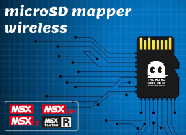

# MSX microSD Mapper Wireless



The MSX microSD Mapper Wireless is a project aimed at building upon the success of Luciano Sturaro and Fabio Belavenuto's implementation of the well known MSX SD Mapper.

It features a single slot for microSD cards, a ESP8266 (ESP12E) micro-controller to offer wireless access, and simplified board design. 

With microSD cards becoming increasingly affordable and widely available, that seems to be a better option now. Additionally, the original SD Mapper v2 project had some confusion around the switches used to control the megaram/mapper, which were later changed in versions of the firmware to enable and disable the mapper on v2.

The ESP8266 enables network connectivity for the microSD card when it is inserted into the cartridge slot. Through a WebDAV server, it provides a convenient method for accessing and modifying the cartridge storage from any networked PC at any time, without requiring adapters, and eliminating the need for repeatedly removing and reinserting the memory card.

If you need detailed step by step instructions on how to build the cartridge, check the article written on the [The Retro Hacker](https://www.theretrohacker.com) website.

## Hardware Versions

* [microSDmapper v1.0](hardware/microsdmapper_v1.0/) - Initial test board with the basic configuration. (not working)
* [microSDmapper v1.1](hardware/microsdmapper_v1.1/) - Prototype board with the initial circuit, basic wiring for the ESP12E/8266 and a pin header to wire a display to show the MAC, and IP address acquired via DHCP. (not working without bodge wires)
* [microSDmapper v1.2](hardware/microsdmapper_v1.2/) - Prototype board with the validated circuit. Tested with the ESP12E/8266 and the access to the microSD card. (working)

## CPLD

The microSD Mapper is compatible with the standard VHDL code made by Fabio Belavenuto for the well known SD Mapper v2. It uses the Xilinx XC95144XL_TQ100 CPLD.

A copy of the source VHDL code, as well as the synthesized [sdmapper.jed](cpld/sdmapper.jed) file are available on this GitHub repository as a reference.

If you want to synthesize the code by yourself and/or program the CPLD you will need a Xilinx programmer and the Xilinx ISE Webpack.

## ESP8266/ESP12E Firmware

The ESP8266/ESP-12E microcontroller is used in the microSD mapper project to provide convenient access to the microSD card from a WebDav client, such as Windows Explorer. The microcontroller executes a program that implements a basic WebDav server, enabling access to the microSD content and allowing for wireless updates to its content.

Additionally, the microcontroller drives a small 128x32 OLED panel, displaying information on the status of the WebDav server and the IP address obtained by the Wireless interface.

The wireless network can be configured through a small website hosted on the root of the server. Upon the first boot, the ESP8266 activates a SoftAP that listens for HTTP connections made to 192.168.4.1. By accessing this website through a browser, the SSID and password for the wireless connection can be configured. Once saved, this configuration is stored on the ESP8266's EPROM and reused for subsequent connections. Modifications to the wireless configuration parameters can be made at any time by returning to the website.

When the webdav server starts, the code saves a file named IP.CFG on the root of the microSD card. If access to the OLED screen is not available, the IP.CFG file can be used to determine the IP address in use.

The code also monitors the CS signal and attaches itself to the "sdmapper bus". That is to avoid any conflicts with the MSX computer trying to save files at the same time you perform the same via the WebDav server.

## BIOS

The BIOS used on the microSD Mapper is a Nextor ROM that uses the driver created by Fabio Belavenuto and Fabio R. Schmidlin for the original SDMapper. I just made some changes on the assembly code to support the microSD mapper by detecting just one microSD card and also built the ROM using the the current/latest version (2.1.1) of the Nextor base. 

The modified code can be used to build the driver and the MKNEXROM tool can be used to built the Nextor ROM that needs to be flashed to the cartridge.

If you just want to flash a working version of the Nextor ROM to your cartridge, use the [FBL-UPD.COM](software/updater/FBL-UPD.COM) to load the [msdmap.rom](software/driver/msdmap.rom) executing the following command from your MSX-DOS or NEXTOR in a MSX with the microSD Mapper cartridge inserted:

```
FBL-UPD.COM msdmap.rom
```

After executing the command you will get a message that the BIOS was flashed to the cartridge.

If you want to build the driver from the source code, you will need to use [sjasmplus.exe](software/driver/sjasmplus.exe) to build the [driver.bin](software/driver/driver.bin) file and then use the [mknexrom.exe](software/driver/mknexrom.exe) tool to build the [msdmap.rom](software/driver/msdmap.rom) Nextor rom. 

You can do that by executing the commands below from the [driver](software/driver) folder:

```
sjasmplus.exe driver.asm

mknexrom.exe Nextor-2.1.1.base.dat msdmap.rom /d:driver.bin
```

## License 

This work is licensed under the CERN OHL-S v2. You may redistribute and modify this project and its documentation under the terms of the CERN-OHL-S v2.

